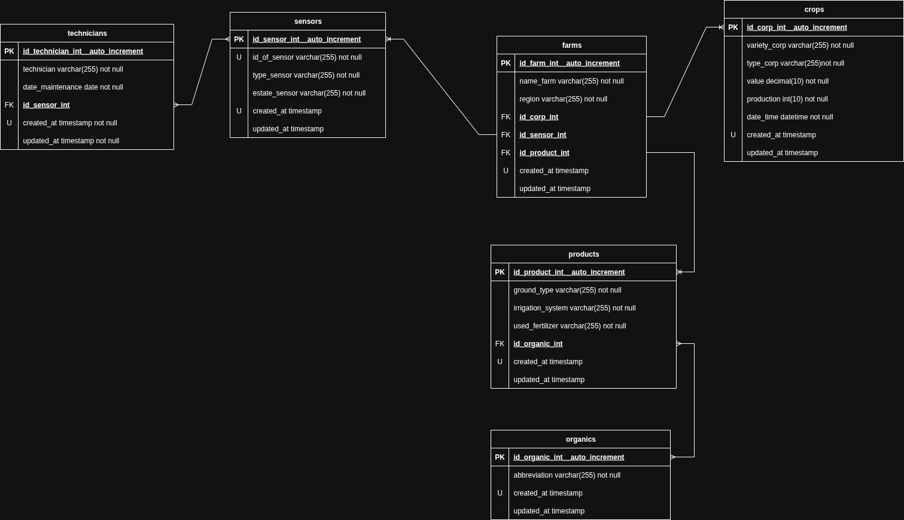

# Agrovida

Agrovida is a data management app for agricultural operations, built with JavaScript, Node.js, Express, and MySQL. It provides RESTful API endpoints for managing farms, crops, products, sensors, technicians, and organic certifications.

## Technologies Used
- Node.js (ES Modules)
- Express.js
- MySQL (mysql2)
- JavaScript (ES6+)
- csv-parser
- Postman (for API testing)

## How to Install Dependencies

1. Make sure you have [Node.js](https://nodejs.org/) and [MySQL](https://www.mysql.com/) installed.
2. In your project root, run:
   ```bash
   npm install express mysql2 csv-parser cors
   ```

## How to Run the Project

1. Configure your MySQL database and update the connection settings in `backend/server/conection_db.js`.
2. Start the server:
   ```bash
   node backend/server/index.js
   ```
   The API will be available at `http://localhost:3001/`.

## Normalization Explanation

The database is normalized to at least 3NF:
- Each table represents a single entity (farms, crops, products, etc.).
- Foreign keys relate entities and avoid data redundancy.
- Data integrity and efficient queries are ensured.

## Bulk Data Load from CSV

1. Place your CSV files in `backend/server/data/`.
2. Run each seeder script:
   ```bash
   node backend/seeders/loadorganics.js
   node backend/seeders/loadproducts.js
   node backend/seeders/loadcrops.js
   node backend/seeders/loadsensors.js
   node backend/seeders/loadtechnicians.js
   node backend/seeders/loadfarms.js
   ```

## Relational Model Screenshot


*See the `docs` folder for the full ER diagram.*



## Developer Information

- **Name:** Wilffren Muñoz
- **Location:** Malecon
- **Email:** wilffren14@gmail.com